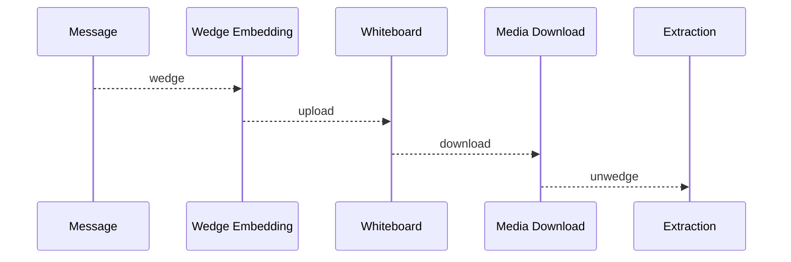
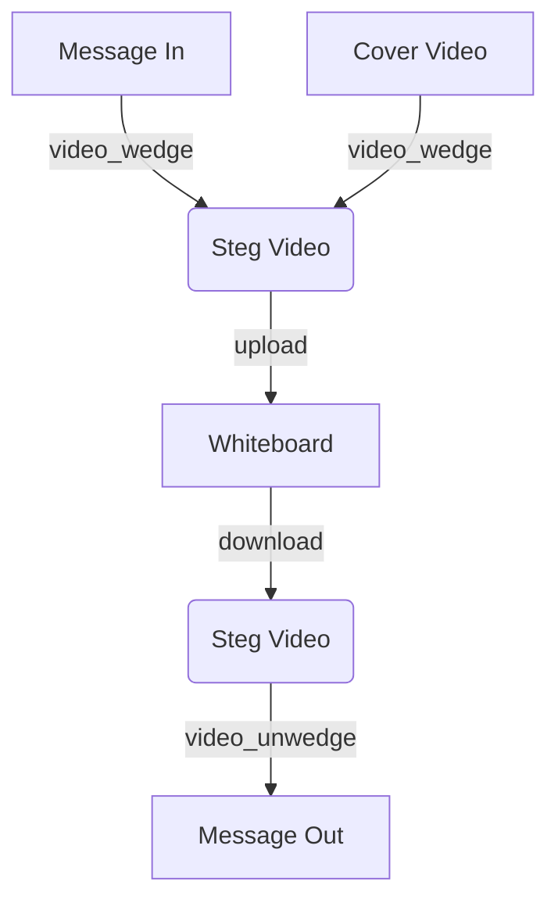
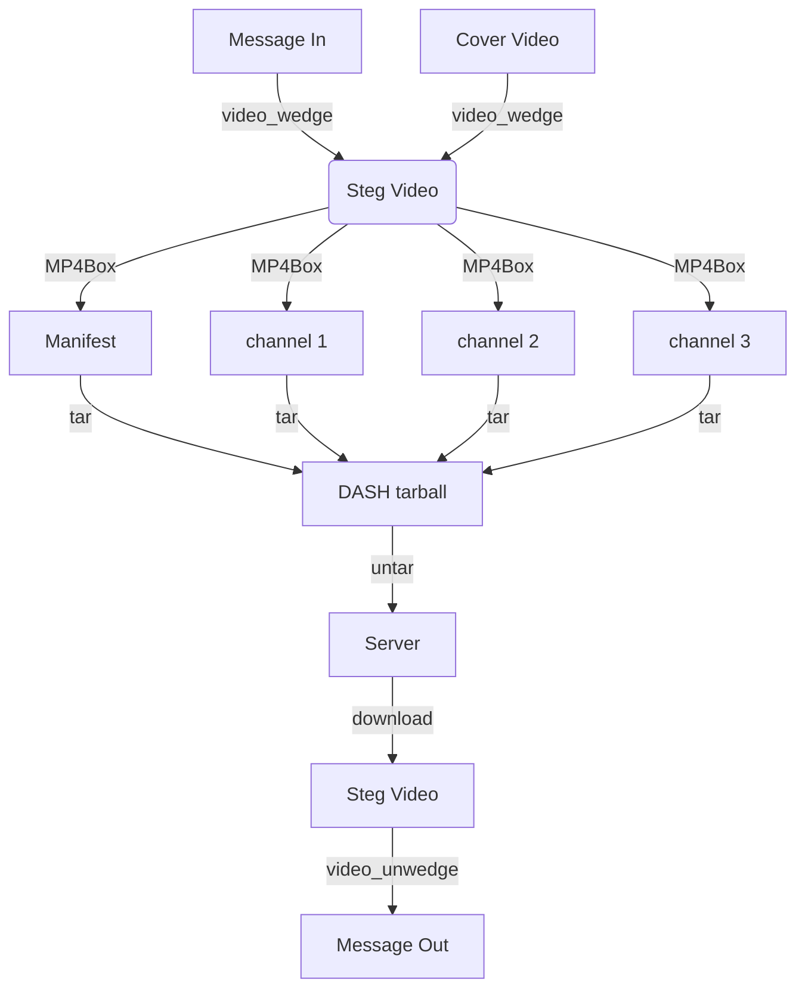
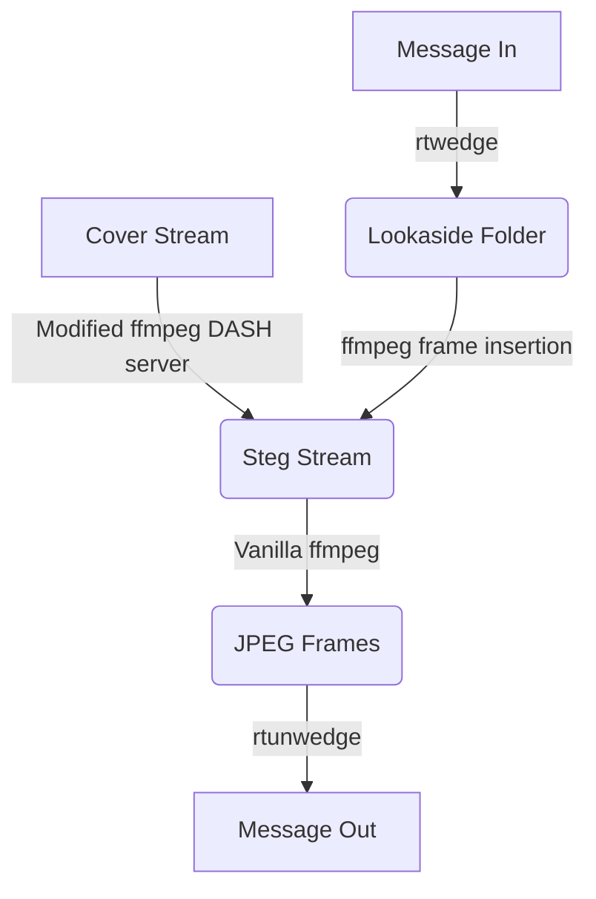

# **Resilient Anonymous Communication for Everyone (RACE) DESTINI Guide**


## **Table of Contents**
  * [**Terminology**](#terminology)
  * [**Introduction**](#introduction)
    + [**Design Goals**](#design-goals)
    + [**Security Considerations**](#security-considerations)
  * [**Scope** This developer guide covers the *DESTINI*](#scope-this-developer-guide-covers-the-destini)
    + [**Audience**](#audience)
    + [**Environment**](#environment)
    + [**License**](#license)
    + [**Additional Reading**](#additional-reading)
  * [**Implementation Overview**](#implementation-overview)
  * [**Implementation Organization**](#implementation-organization)
  * [**How To Build**](#how-to-build)
    + [libjel and utilities](#libjel-and-utilities)
      - [**Tests**](#tests)
  * [**Troubleshooting**](#troubleshooting)
    + [**Build Tips**](#build-tips)
    + [**Common Issues**](#common-issues)

<br></br>

## **Terminology**
*add implementation-specific terms and acronyms*
<br><b>DCT</b>: Discrete Cosine Transform</br>
<br><b>MCU</b>: Minimum Coding Unit - a 8x8 or 16x16 pixel block of a JPEG image.</br>
<br><b>JPEG</b>:  Joint Photographic Experts Group, usually refers to the image exchange
format defined by this group.</br>
<br><b>"Stegging"</b>: The act of steganographically embedding a message in media, as in
"We are stegging <tt>msg.dat</tt> into <tt>cover.jpg</tt>".</br>
<br><b>"Stegged"</b>: Media within which a message has been steganographically embedded,
as in "The file <tt>mysteg.jpg</tt> is a stegged version of <tt>cover.jpg</tt>".</br>

<br></br>

## **Introduction**
This repo includes exemplars of the set of transports that where
implemented as part of the DESTINI project.  Specifically, it
includes four indirect and two direct link transports.


1) Image Steganography-based Transports: Pixelfed (indirect), Flickr (indirect), Tumblr (indirect)

2) Video Steganography-based Transports: Avideo (indirect), Dash (direct)

3) Game-based Transports: Minecraft (direct)

</br>

### **Design Goals**

<b>Image Steg Transports</b>: Our objective was to examine the feasibility of
the development of detection-resilient, low-bandwidth RACE
client-server communications through whiteboard based channels.  Key
design considerations are detectability, latency, bandwidth, and
transcoding resilience of the channel.

<p>Our steganographic approach embeds information in the DCT
coefficients of the Minimum Coding Units (MCUs) of a JPEG image.  When
heavily quantized frequency components are used, this approach offers
some resilience against certain transcoding operations, since the
"noise" induced by transcoding is naturally stabilized by
frequency-domain quantization.</p>

<b>Avideo Transport</b>:  Avideo is similar to image-steg-based transports, with the
exception that it has higher latencies and bandwidth.

<b>Dash Transport</b>: The current implementation uses Pixelfed as a
signaling channel for DASH.  However, that dependency was simply for
ease of prototyping.  In practice, the URL could be send through any
other channel.  The DASH transport is optimized for bandwidth
and not for steganographic resilience.  We assume that the underlying
stream is TLS protected.

<b>Minecraft Transport</b>:  

### **Security Considerations**

Image Steg and Avideo Transports: We assume that adversaries monitor
whiteboards for suspicous posts.  We assume that users generate their
own cover files and that the adversary does not have a database of
cover files.  We also assume that the seeds used for encoding and
decoding are not known to the adversary.

Dash Transport:  We assume that the adversary can observe the packet
sizes and timings of DASH transports.


<br></br>

## **Scope** This developer guide covers the *DESTINI*
development model, building artifacts, running, and
troubleshooting. It is structured this way to first provide context,
associate attributes/features with source files, then guide a
developer through the build process.

*additional detail as appropriate*
</br>

### **Audience**

We assume that the reader is familiar with based networking, container technologies, and Tor pluggable transports.

### **Environment**
Pixelfed: runs on Linux and Android
Avideo and Dash: runs on Linux


### **License**
*State all license related information*

### **Additional Reading**
* [RACE Quickstart Guide](https://github.com/tst-race/race-quickstart/blob/main/README.md)

* [What is RACE: The Longer Story](https://github.com/tst-race/race-docs/blob/main/what-is-race.md)

* [Developer Documentation](https://github.com/tst-race/race-docs/blob/main/RACE%20developer%20guide.md)

* [RIB Documentation](https://github.com/tst-race/race-in-the-box/tree/2.6.0/documentation)

<br></br>

## **Implementation Overview**

The DESTINI framework for media steganography is divided into two layers: 1) the social media transport layer, and 2) the media steganography layer (exemplified by the libjel library and utilities).

*Mermaid flow diagram(s) to illustrate internal state, and other interesting inter-workings*

There are several Mermaid diagrams in this document. See https://docs.github.com/en/get-started/writing-on-github/working-with-advanced-formatting/creating-diagrams for more info about viewing Mermaid diagrams in github. Mermaid diagrams can also be viewed in Visual Studio with Marketplace extensions: Markdown, and Markdown Preview Mermaid Support.


The basic JPEG steganography data flow starts with a
<tt>wedge</tt>operation to embed data in media, followed by a
whiteboard upload.  The receiver subsequently performs a media
download, followed by an <tt>unwedge</tt> operation to retrieve the
data, as shown in this diagram:



For video steganography, the <tt>video_wedge</tt> tool breaks the
cover video down into individual frames, and a <tt>wedge</tt>
operation is performed on each frame.  Generally, video will allow
much more content ot be embedded.  Video is then uploaded to a
whiteboard.  The receiver subsequently downloads the video and uses
<tt>video_unwedge</tt> to recover data from each frame, as shown in
this diagram:



Modular DASH video creation produces a DASH manifest and a set of
video channels that are available for client rendering.  Typically,
these channels represent different bitrates, depending on the
client-server connection quality.  Channels can vary in screen
resolution and video quality levels (compression).  Our DASH strategy
is to steg to the lowest available bitrate, causing all channels to
contain the same steg content.  This way, there is little or no
message loss when the client and server negotiate to a new channel
(higher or lower bandwidth).

Given a cover video, the shell script in

<tt>external/jel2/video/dash-recipe.sh</tt>

uses <tt>video_wedge</tt> and <tt>MP4Box</tt> to embed steganographic
content into a DASH video.  The usage is:

<tt>dash-recipe.sh VIDEO MESSAGE</tt>

Where VIDEO is the name of the cover video file and MESSAGE is a file
containing a message to be stegged.  The result is a tarball called
<tt>XXX-dash.tgz</tt> where XXX is the basename for VIDEO.  This
tarball contains the mp4 videos for each channel along with a manifest
file with suffix <tt>.mpd</tt>.  This tarball can be untarred into a
server directory for download by clients.

On the receiving side, it's sufficient to point ffmpeg at the URL of
the manifest and copy the content into a flat <tt>.mp4</tt> file.  You
can then use video_unwedge to extract steg content from that file.




For DASH streaming, we use a fork of ffmpeg (FFMpeg_cc) that contains
modifications of its DASH streaming server.  These mods cause the
server to check a lookaside folder for any stegged frames to use in
place of frames in the cover stream.  This folder is populated by the
<tt>rtwedge</tt> tool that will embed content into selected frames of
the video.  If steg frames are available in that folder, the streamer
will use those in place of the corresponding cover frames, preserving
timestamps and order, and will delete them from the lookaside folder
after insertion.  On the receiving side, an unmodified version of
ffmpeg can be used to retrieve frames as JPEGs.  The
<tt>rtunwedge</tt> script will cull the output, assembling extracted
messages and deleting frames after an extraction attempt has been
made.  Here is a diagram outlining the data flow for steg over
streaming DASH:




<br></br>

## **Implementation Organization**

The core steganographic functions of this system are handled by two
command-line executables: <tt>wedge</tt> and <tt>unwedge</tt>.  An additional utility called <tt>wcap</tt>
reports the amount of available space in a cover image subject to options.  These
utilities are part of the jel2 library.

<h2><tt>wedge</tt> Usage:</h2>
<pre>
wedge [switches] inputfile [outputfile]
Embeds a message in a jpeg image.
Switches (names may be abbreviated):
  -message M      Wedge a string M into the image
                  If not supplied, stdin will be used.
  -nolength       Do not embed the message length.
  -ecc L          Set ECC block length to L bytes.
  -noecc          Do not use error correcting codes.
  -quanta N       Ask for N quanta for embedding (default=8).
                  NOTE: The same value must used for extraction!
  -quality Q      Ask for quality level Q for embedding (default=same as input quality).
  -freq a,b,c,d   Encode using frequencies corresponding to indices a,b,c,d
                  If this is specified, -quanta is ignored.
                  NOTE: The same values must used for extraction!
                  Overrides -maxfreqs.
  -nfreqs <N>     Use N frequency components per MCU for embedding (default=1).
  -bpf <M>        Use M bits per frequency for encoding (default=1).
  -maxfreqs <M>   Allow M frequency components to be available for embedding (default=6).
                  Only the first N are used, but if seed is supplied, they are randomized.
  -mcudensity <M> Allow M percent of MCUs to be available for embedding.
                  M must be <= 100.
                  If M is -1 (the default), then the density is auto-computed based on the message size.
  -data    <file> Use the contents of the file as the message (alternative to stdin).
  -outfile <file> Filename for output image.
  -seed <n>       Seed (shared secret) for random frequency selection.
  -raw            Do not embed a header in the image - raw data bits only.
  -setval         [IGNORED] Do not set the LSBs of frequency components, set the values.
  -normalize      Operate on true DCT coefficients, not the 'squashed' versions in quant space.
  -setdc <dc>     Set the DC component to the given value for every MCU that gets touched.
  -debug_mcu <k>  Show the effect of embedding on the kth active MCU.
  -clearac        Set all AC components to 0 before embedding.
  -component <c>  Components to use in order, eg 'y', 'yu', 'uyv', etc...
  -verbose <level> or  -debug   Emit debug output
  -version        Print version info and exit.
</pre>

<p>The most common application of <tt>wedge</tt> embeds a message
contained in a file using the <tt>-data FILE</tt> switch,
where the first non-switch argument is a cover image.  For example:
<pre>
        wedge my_cover.jpg -data foo.dat my_steg_out.jpg
</pre>
will use the "my_cover.jpg" cover image and default parameter settings to steganographically embed the
contents of "foo.dat" into the image, then write the result in
"my_steg_out.jpg".
</p>


<p>Here are deeper explanations for the most useful command line switches:
<ul>
<li><tt>-component C</tt>: This switch specifies the component(s) to use for embedding.  C can be any combination of 'y', 'u', or 'v', corresponding to the planes of the YUV color model.
By default, only 'y' (luminance) is used.  The 'u' and 'v' components are color components, and can be used to provide extra embedding capacity.  To use all three planes, specify 'yuv'.  This will double the capacity of the default 'y' setting.</li>
<li><tt>-ecc L</tt>: This switch enables the use of Reed-Solomon ECC to perform error correction on the stegged message.  The argument L is the ECC block length in bytes.</li>
<li><tt>-quality Q</tt>: This switch forces <tt>wedge</tt> to use the frequency components corresponding to the JPEG quality level Q.  Use caution: For now, it is preferable to transcode the image to the desired quality level, since the quantization table estimates used in <tt>wedge</tt> are not always accurate with respect to manual transdoding with external utilities.  By default, Q is the jpeg quality level of the cover image.</li>
<li><tt>-freq a,b,c,d</tt>: forces the use of frequency indices a, b, c, d for steganographic embedding.  JPEG frequency indices range from 1 to 64, with lower indices correspoonding to lower frequencies within the JPEG zig-zag pattern.  This option is only recommended for those who are familiar with JPEG internals.  By default, <tt>wedge</tt> and <tt>unwedge</tt> will choose the proper frequency indices automatically.</li>
<li><tt>-nfreqs F</tt>: Causes <tt>wedge</tt> to embad information in F frequencies per MCU.  By default, F is 4.</li>
<li><tt>-bpf M</tt>: Encodes M bits of information per frequency component in an MCU.  By default, M is 2.</li>
<li><tt>-maxfreqs N</tt>: Uses at most N frequencies per MCU for embedding.  N should be greater than or equal to F.  When a seed is supplied, F frequencies are chosen at random out of the top N frequencies available at the given quality level.</li>
<li><tt>-mchdensity D</tt>: D is the density for MCU selection as a percentage of the number of MCUs in the image.  If a seed is provided, these MCUs are chosen at random.</li>
<li><tt>-seed S</tt>: S is the seed for the pseudorandom number generator that is used to select MCUs and frequency components for each MCU.  It is a shared secret that is required for
<tt>wedge</tt> and <tt>unwedge</tt> to successfully encode and decode a given message.
</ul>


The following <tt>wedge</tt> switches should not be used, as they are at best experimental or diagnostic:
<ul>
<li><tt>-nolength</tt></li>
<li><tt>-quanta</tt></li>
<li><tt>-raw</tt></li>
<li><tt>-setval</tt></li>
<li><tt>-normalize</tt></li>
<li><tt>-setdc</tt></li>
<li><tt>-clearac</tt></li>
</ul>

<p>The <tt>unwedge</tt> utility reverses the <tt>wedge</tt> action,
recovering the message from stegged media according to the supplied
options and parameters:

<h2><tt>unwedge</tt> Usage:</h2>
<pre>
usage: unwedge [switches] inputfile [outputfile]
    where 'inputfile' is a steg image, and 'outputfile' is the extracted message.
Switches (names may be abbreviated):
  -length    N   Decode exactly N characters from the message.
  -ecc L          Set ECC block length to L bytes.
  -noecc         Do not use error correcting codes.
  -outfile name  Specify name for output file
  -quanta N      Ask for N quanta for extraction (default=8).
                 NOTE: The same value must used for embedding!
  -freq a,b,c,d  Decode message using specified freq. component indices.
                 If this is specified, -quanta is ignored.
                 NOTE: The same values must used for extraction!
  -nfreqs <N>     Use N frequency components per MCU for embedding (default=1).
  -bpf <M>        Use M bits per frequency for encoding (default=1).
  -maxfreqs <N>   Allow N frequency components to be available for embedding (default=6).
                  Only the first 4 are used, but if seed is supplied, they are randomized.
  -mcudensity <M> Allow M percent of MCUs to be available for embedding.
                  M must be <= 100.
                  If M is -1 (the default), then all MCUs are used.
  -seed <n>      Seed (shared secret) for random frequency selection.
  -debug_mcu <k>  Show the effect of embedding on the kth active MCU.
  -raw            Do not try to read a header from the image - raw data bits only.
  -setval         [IGNORED] Do not set the LSBs of frequency components, set the values.
  -normalize      Operate on true DCT coefficients, not the 'squashed' versions in quant space.
  -component <c>  Components to use in order, eg 'y', 'yu', 'uyv', etc...
  -verbose <level>  or  -debug   Emit debug output
</pre>

<p>Here are deeper explanations for the most useful command line switches.   Most are related to the corresponding <tt>wedge</tt> options, and should match
across invocations of <tt>wedge</tt> and <tt>unwedge</tt>
<ul>
<li><tt>-component C</tt>: This switch specifies the component(s) to use for embedding.  C can be any combination of 'y', 'u', or 'v', corresponding to the planes of the YUV color model.
By default, only 'y' (luminance) is used.  The 'u' and 'v' components are color components, and can be used to provide extra embedding capacity.  To use all three planes, specify 'yuv'.  This will double the capacity of the default 'y' setting.</li>
<li><tt>-ecc L</tt>: This switch enables the use of Reed-Solomon ECC to perform error correction on the stegged message.  The argument L is the ECC block length in bytes.</li>
<li><tt>-freq a,b,c,d</tt>: forces the use of frequency indices a, b, c, d for steganographic embedding.  JPEG frequency indices range from 1 to 64, with lower indices correspoonding to lower frequencies within the JPEG zig-zag pattern.  This option is only recommended for those who are familiar with JPEG internals.  By default, <tt>wedge</tt> and <tt>unwedge</tt> will choose the proper frequency indices automatically.</li>
<li><tt>-nfreqs F</tt>: Causes <tt>wedge</tt> to embad information in F frequencies per MCU.  By default, F is 4.</li>
<li><tt>-bpf M</tt>: Encodes M bits of information per frequency component in an MCU.  By default, M is 2.</li>
<li><tt>-maxfreqs N</tt>: Uses at most N frequencies per MCU for embedding.  N should be greater than or equal to F.  When a seed is supplied, F frequencies are chosen at random out of the top N frequencies available at the given quality level.</li>
<li><tt>-mchdensity D</tt>: D is the density for MCU selection as a percentage of the number of MCUs in the image.  If a seed is provided, these MCUs are chosen at random.</li>
<li><tt>-seed S</tt>: S is the seed for the pseudorandom number generator that is used to select MCUs and frequency components for each MCU.  It is a shared secret that is required for
<tt>wedge</tt> and <tt>unwedge</tt> to successfully encode and decode a given message.
</ul>

The following <tt>unwedge</tt> switches should not be used, as they are at best experimental or diagnostic:
<ul>
<li><tt>-length</tt></li>
<li><tt>-debug_mcu</tt></li>
<li><tt>-quanta</tt></li>
<li><tt>-raw</tt></li>
<li><tt>-setval</tt></li>
<li><tt>-normalize</tt></li>
</ul>

<h2>Whiteboard Transport Layer</h2>

To separate steganographic embedding from the issues associated with
whiteboard operations, we implemented a family of whiteboard transport
layer classes that manage authentication and media operations (upload,
download, search and deletion) within supported whiteboards.

Whiteboard classes are built on the "BaseWB" class.  When creating a
whiteboard instance, the caller must supply a user name for use in
authentication.  By default, a file called "wbauth.json" should be
present that contains a dictionary that maps user names to
authentication credentials for each whiteboard.  The BaseWB class is
implemented by:

<b><tt>source/genericWB.py</tt></b>: Base class for a
whiteboard-agnostic API.   All whiteboard transports built on this class need to implement the following methods (where "wb" is an instance):
<ol>
<li><tt>wb.authorize()</tt>: authenticates a user.</li>
<li><tt>wb.image_upload(image_source, title, tags)</tt>: Uploads an image to the whiteboard from image_source (typically a file), with the title and tags provided by the caller.  Returns a "WBImage" object, which is a whiteboard-agnostic media object.</li>
<li><tt>wb.image_delete(wbimage)</tt>: Deletes the whiteboard media corresponding to the WBImage argument.</li>
<li><tt>wb.image_search(title=None, tags=None, since=None)</tt>: Searches the whiteboard by title, tags, or time.  Returns a list of WBImage objects matching the search criteria.</li>
<li><tt>wb.image_download(wbimage, to_file)</tt>: Given a WBImage object containing a media URL, ths will download the media to the file "to_file".</li>
</ol>


## **How To Build**

### libjel and utilities

The libjel library supplies steganographic capability.  It appears in the jel2 subdirectory and can be built as follows:
<pre>
cd jel2
autoreconf -fvi
./configure --enable-silent-rules
</pre>

After this, the configure and makefiles should be ready for use.  Next type <tt>make</tt> to build libjel and the utilities (including <tt>wedge</tt>, <tt>unwedge</tt> and <tt>wcap</tt>.

The jel libraries and utilities can be installed under
<tt>/usr/local</tt> by typing <tt>make install</tt>.

Also see [ext-jel2](https://tst-race/ext-jel2/) for examples of building for Linux and Android for x86 and arm64 hosts.

</br>


## **How To Run**
### Destini Pixelfed (Images on "Social Media")
Include in a RACE deployment by adding the following arguments to a `rib deployment create` command:
```
--comms-channel=destiniPixelfed --comms-kit=<kit source for destiniPixelfed>
```

### Destini Avideo (Videos on "Social Media")
Include in a RACE deployment by adding the following arguments to a `rib deployment create` command:
```
--comms-channel=destiniAvideo --comms-kit=<kit source for destiniPixelfed>
```

### Destini DASH (Videos streamed from a RACE server node)
Include in a RACE deployment by adding the following arguments to a `rib deployment create` command:
```
--comms-channel=destiniDash --comms-kit=<kit source for destiniPixelfed>
```

#### **Tests**
*The libjel library provides regression tests using a JPEG image corpus.*

*cd into the 'test' subdirectory of jel2*

Then type "../regression-test-v2.py -dir inria".  This will invoke a
regression test against the INRIA holidays image set.  The color GREEN
indicates success.  The numbers indicate the number of bytes encoded
during the test.  The colors yellow and red indicate failure.  At this
time, failure is expected for certain parameter settings.  Since the
tests are stochastic, rare errors are to be expected but most tests
should succeeed.

</br>

<br></br>

<br></br>

## **Troubleshooting**


*State general troubleshooting philosophy*

1) Check services are up
2) Ensure that point-to-point (network-manager-bypass) messages are working
3) Look at messages in race.log


*How to verify functionality is working and enabled*

Create an appropriate deployment and try sending messages between two clients.
Indirect transports can be used for both client-to-server and server-to-server links.
Direct transport can be used only for server-to-server links.

<br></br>
